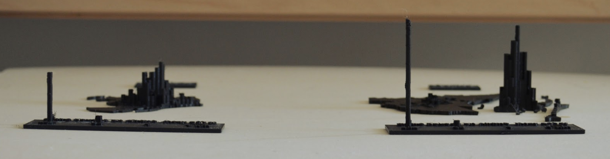
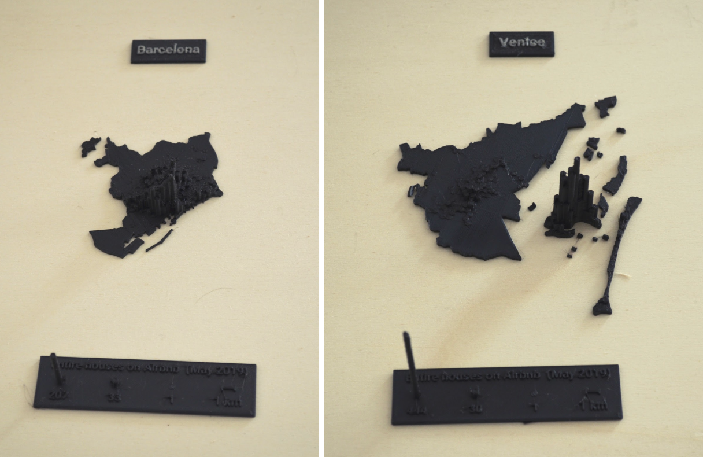
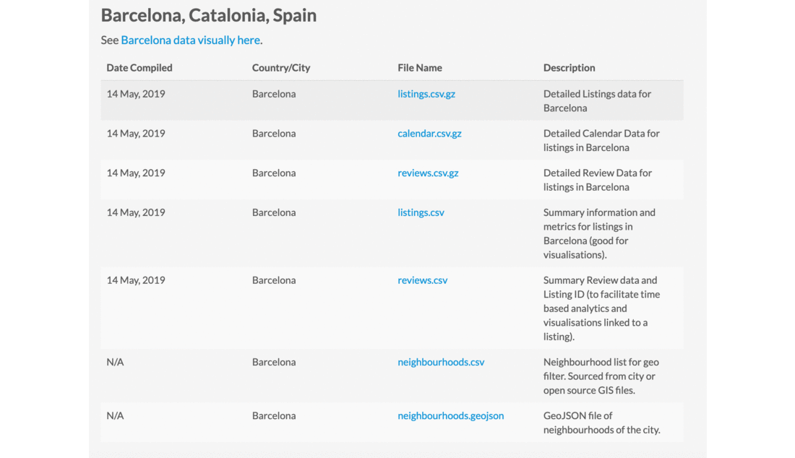

 

# Tactile Data Maps

This repo contains all the files mentione in the article "Let’s get physical: how to represent data through touch".

The article contains a tutorial on how to create two 3D printed maps portraying data from the website [Inside Airbnb](http://insideairbnb.com/), 
an independent watchdog that collects data to help researchers assess the impact of Airbnb in their city’s housing stock. 
We’ll focus on two European cities that symbolically sit at the opposite end of the spectrum in terms of regulation: 
Barcelona and Venice. 
On one hand, Barcelona can be seen at the frontlines in restricting touristic short-term rentals through a system of licenses 
and quotas, and via a direct agreement with Airbnb to access hosts’ data. 
On the other, Venice has very limited regulation, mostly on tax issues. 
Specifically, we are going to visualise  physicalise the number of entire apartment listings in a hexagon grid map.
Once you familiarise yourself with the process, this same process can be repeated for any of the 70+ cities for which you find data on the Inside Airbnb website. 

We are going to design the maps separately, so that they can be presented independently or next to each other like a series of small multiples maps. 

 

*The design and fabrication of these maps have been developed by [Chi ha ucciso il Conte?](http://chihauccisoilconte.eu/), and Italian designer and expert in digital fabrication and open source software.*

## In this repo
This repo contains a folder for each city. Inside each folder you will find several files:   

1. `cityname-listings.csv`: file with the coordinates and details of all the Airbnb listings in the city.
2. `cityname-neighbourhoods.geojson`: geographical boundaries of the neighbourhoods of the city.
3. `cityname-boundaries.svg`: vector graphics file with the outer boundaries of the city.
4. `cityname-airbnb.shp`: shapefile with a hexagonal grid vector layer, containing the number of entire apartments in each hexagonal area, filterd to include only areas with 1 or more apartment.
5. `cityname-base.stl`: file with an extruded square base for the map.
6. `cityname-city-map.stl`: file with the extruded 3D boundaries of the city.
7. `cityname-airbnb3d.stl`: file with the 3D model of the hexagonal maps, with the height of each hexagon defined by the number of entire apartment listings in that area.
8. `cityname-airbnb-3dprint.gcode`: file that can be sent to the 3D printer for production. **Note: this specific file has been crafted specifically for the Prusa i3 MK3 and is guaranteed to work with this machine only. For all other cases, please follow the tutorial specific to your machine model, get in touch with your local Fab Lab or Hacker space, or contact the authors.**

 
